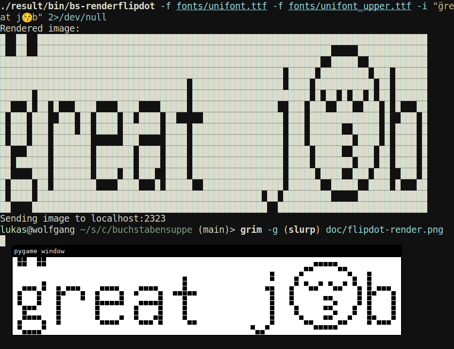

# buchstabensuppe

```
 █             
 █             
 █             
 █ ███    ████ 
 ██   █  █    █
 █    █  █     
 █    █   ██   
 █    █     ██ 
 █    █       █
 ██   █  █    █
 █ ███    ████ 
```

> at least better than PIL.ImageFont

toy font rendering for low pixelcount high contrast displays,
i. e. [openlab's flipdot display](https://wiki.openlab-augsburg.de/Flipdots).

## features

* supports [text shaping](https://harfbuzz.github.io/what-is-harfbuzz.html#what-is-text-shaping)
  via harfbuzz
* per grapheme cluster font fallback
* grayscale and binary b/w support

## building

requirements:

* [redo-c](https://github.com/leahneukirchen/redo-c)
* Optionally `make` for install script and such
* [utf8proc](https://juliastrings.github.io/utf8proc)
* [harfbuzz](harfbuzz.github.io/)

```
# run inside nix-shell if you have nix!

# static library
$ redo libbuchstabensuppe.a

# demo binary
$ redo bs-renderflipdot.exe

# tests
$ redo test.exe && ./test.exe
```

alternatively you can just run `nix-build`

## demo

if you want to play around with the font rendering in binary
mode you can use the dry run mode of the supplied `./bs-renderflipdot.exe`
(or `./result/bin/bs-renderflipdot` if you use nix) binary.

Run `./bs-renderflipdot.exe -?` for usage instructions and don't forget `-n`
for dry running!

```
$ ./bs-renderflipdot.exe -f fonts/unifont.ttf -f fonts/unifont_upper.ttf -n "Greetings ❣️" 2>/dev/null
                                                                                            
                                                                                    ███ ███ 
                                                                                   █████████
                                            █                                      █████████
  ████                             █        █                                      █████████
 █    █                            █                          █                     ███████ 
 █    █  █ ███    ████    ████     █       ██    █ ███    ███ █   ████                ███   
 █       ██   █  █    █  █    █  █████      █    ██   █  █   █   █    █                █    
 █       █    █  █    █  █    █    █        █    █    █  █   █   █                          
 █  ███  █       ██████  ██████    █        █    █    █  █   █    ██                  ███   
 █    █  █       █       █         █        █    █    █   ███       ██               █████  
 █    █  █       █       █         █        █    █    █   █           █              █████  
 █   ██  █       █    █  █    █    █        █    █    █   ████   █    █              █████  
  ███ █  █        ████    ████      ██    █████  █    █  █    █   ████                ███   
                                                         █    █                             
                                                          ████                              
```

## flipdot interaction



the picture above shows buchstabensuppe being used to render text
onto a simulated flipdot display. take notice especially of the following:

* fallback fonts are supported: the emoji is not found in `unifont.ttf`,
  but rendered from `unifont_upper.ttf`
* correct text shaping is supported (as far as the font supports it):
  g̈ which consists of two codepoints is rendered as a combined cluster
  consisting of two glyphs.

[bs-renderflipdot.c](./bs-renderflipdot.c) is a simple example showing
how to interact with a flipdot display. mainly it involves:

* rendering a string to a bitmap using `bs_render_utf8_string`
* making sure that the dimensions of the display and the image
  match with `bs_bitmap_extend`
* processing the resulting bitmap using `bs_bitmap_map`
* producing a compacted bitmap array for the display
  using `bs_view_bitarray` ready to sent via UDP

you can also play around with its cli: the following command
renders “Hello World” black on white using GNU Unifont onto
a flipdot display (or simulator) running on `localhost:2323`.
See `./bs-renderflipdot.exe -?` for more usage details.

```
./bs-renderflipdot.exe -f /path/to/unifont.ttf -f /path/to/unifont_upper.ttf -i "Hello World"
```

## caveats

* buchstabensuppe loads all fonts into memory and keeps them there pretty much
  all the time.
* buchstabensuppe uses `stb_truetype` which does
  [no boundary checking on fonts](https://github.com/nothings/stb/blob/b42009b3b9d4ca35bc703f5310eedc74f584be58/stb_truetype.h#L4-L11),
  so it is highly inadvisable to use buchstabensuppe with untrusted fonts.
